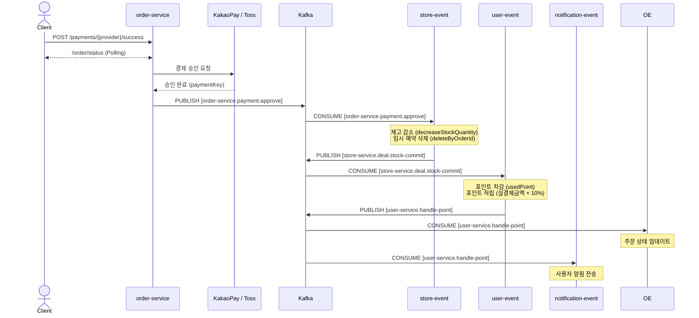
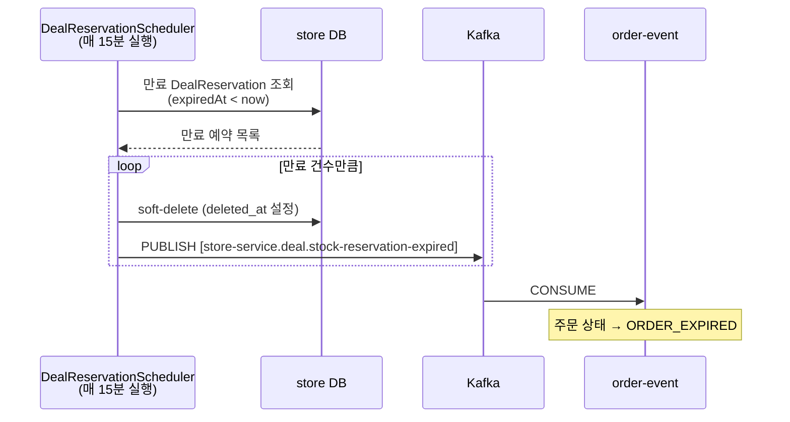

<h1>
  
  PickDeal
</h1>


> 주변 가게의 마감 할인 상품을 픽업하는 서비스입니다.
> 
> 시간이 지날수록 할인율이 높아지는 동적 가격 정책과 Kafka 기반 이벤트 체이닝을 통해 분산 환경에서 안전한 재고 처리 및 주문 흐름을 구현했습니다.

<br/>

## 목차

- [기술 스택](#기술-스택)
- [전체 아키텍처](#전체-아키텍처)
- [프로젝트 구조](#프로젝트-구조)
- [주요 기능](#주요-기능)
- [이벤트 플로우](#이벤트-플로우)
  - [결제 흐름](#결제-흐름)
  - [보상 트랜잭션](#보상-트랜잭션)
  - [예약 만료 플로우](#예약-만료-플로우)
- [이슈 해결](#이슈-해결)
- [로컬 실행 방법](#로컬-실행-방법)


<br/>

## 기술 스택

|| |
|-------------------|-|
| Language / Build  | Java 17, Gradle (Groovy DSL, Multi-module) |
| Framework         | Spring Boot, Spring Cloud |
| Service Discovery | Spring Cloud Netflix Eureka |
| API Gateway       | Spring Cloud Gateway |
| Message Broker    | Apache Kafka (KRaft 3-node cluster) |
| Database          | PostgreSQL + PostGIS (서비스별 독립 DB) |
| Cache / Session   | Redis (JWT Refresh Token, 블랙리스트) |
| ORM               | Spring Data JPA, Hibernate Spatial |
| Security          | Spring Security (JWT) |
| Geospatial        | PostGIS, `ST_DWithin` (반경 검색) |
| PG                 | KakaoPay, Toss Payments (Strategy 패턴) |
| Inter-service     | OpenFeign |

<br/>

## 전체 아키텍처


<br/>

## 프로젝트 구조

```
pick-deal/
├── buildSrc/                  # Gradle 컨벤션 플러그인 (공통 의존성 관리)
├── common-module/             # 공통 DTO, Enum, Kafka Event, JWT 유틸
├── api-gateway/               # 단일 진입점, JWT 인증 필터, 라우팅
├── eureka-server/             # 서비스 레지스트리
│
├── user-service/              # 회원가입, 로그인, JWT 발급, 포인트 조회
├── store-service/             # 가게 등록/조회(반경), 딜 관리, 재고 예약
├── order-service/             # 주문 생성, 결제 처리 (KakaoPay / Toss)
│
├── user-event/                # [Kafka Consumer] 포인트 차감/적립
├── store-event/               # [Kafka Consumer] 재고 확정, 예약 만료 스케줄러
├── order-event/               # [Kafka Consumer] 주문 상태 업데이트
├── notification-event/        # [Kafka Consumer] 사용자 알림 (TODO)
│
└── docker/
    └── docker-compose-local.yml
```

<br/>

## 주요 기능

### 동적 할인 가격 정책
- `DiscountPolicy` 엔티티로 딜별 할인 정책 관리
- `PERCENT` / `AMOUNT` 두 가지 할인 타입 지원
- 설정된 인터벌(분) 마다 할인율 증가, 최대 할인 한도 설정 가능

### 재고 임시 예약
- 주문 시점에 `DealReservation` 레코드 생성 (15분 TTL)
- 결제 미완료 시 스케줄러(매 15분)가 만료 예약을 감지하고 재고 반납
- 추후 Redis Sorted Set + Lua Script 방식으로 전환 가능하도록 구현 병행

### PG 결제
- `PaymentStrategy` 인터페이스 + `KakaoPaymentStrategy` / `TossPaymentStrategy` 구현
- `PaymentProviderHandler`가 `PaymentProvider` enum 기반으로 전략 선택
- 결제 승인 후 이벤트 체인 시작

### 주변 딜 탐색
- PostGIS `ST_DWithin` + geography 캐스팅으로 반경 내 가게 조회
- 딜 목록 조회 시 현재 시각 기준 동적 할인가 계산 (`DiscountCalculator`)

### JWT 인증
- Access Token: 5분, Refresh Token: 15일 (Redis 저장)
- 로그아웃 시 Access Token 블랙리스트 등록
- Gateway에서 검증 후 `x-user-id`, `x-user-role` 헤더를 내부 서비스에 주입

<br/>

## 이벤트 플로우

### Kafka Topics

| Topic | 상수명 | 발행 주체 |
|---|---|---|
| `order-service.payment.approve` | `PAYMENT_APPROVED` | order-service |
| `order-service.payment.fail` | `PAYMENT_APPROVED_FAIL` | order-service, order-event |
| `order-service.payment.cancel` | `PAYMENT_CANCELED` | order-service |
| `order-service.order.cancel` | `ORDER_CANCELED` | order-service |
| `store-service.deal.stock-commit` | `DEAL_STOCK_COMMIT` | store-event |
| `store-service.deal.stock-commit-fail` | `DEAL_STOCK_COMMIT_FAIL` | store-event |
| `store-service.deal.stock-reservation-expired` | `DEAL_STOCK_RESERVATION_EXPIRED` | store-event |
| `user-service.handle-point` | `USER_POINT_APPLIED` | user-event |
| `user-service.handle-point-fail` | `USER_POINT_APPLIED_FAIL` | user-event |

---

### 결제 흐름

결제 승인 이후 비동기로 재고 확정 → 포인트 처리 → 알림까지 자동으로 이어집니다.



---

### 보상 트랜잭션

중앙 오케스트레이터 없이 각 컨슈머가 실패 이벤트를 발행하고 이전 단계를 롤백합니다.


**보상 흐름 요약**

| 실패 시나리오 | 보상 흐름 |
|---|---|
| 결제 승인 실패 (PG 오류) | `PAYMENT_APPROVED_FAIL` → store-event: 예약 삭제 |
| 재고 확정 실패 (품절) | `DEAL_STOCK_COMMIT_FAIL` → order-event: 주문 실패 → `PAYMENT_APPROVED_FAIL` → store-event: 예약 삭제 |
| 포인트 처리 실패 | `USER_POINT_APPLIED_FAIL` → store-event: 예약 삭제 → `DEAL_STOCK_COMMIT_FAIL` → (위와 동일) |
| 사용자 취소 | `PAYMENT_CANCELED` → store-event: 예약 삭제 |

---

### 예약 만료 플로우



## 이슈 해결

### 1. 분산 트랜잭션 — Saga Choreography

**문제**

결제 승인 → 재고 감소 → 포인트 처리가 독립된 서비스에 걸쳐 있어, 중간 단계에서 실패하면 데이터 정합성이 깨지는 문제가 있었습니다.

처음에 PAYMENT_APPROVED 이벤트를 발행하여 독립적인 Consumer가 재고 감소, 포인트 처리를 하였습니다.
이러한 구조는 오류가 발생한 지점을 명확하게 판단하기 어렵기 때문에 이벤트 체이닝을 구현하였습니다.

**고려한 방법**

| 방식 | 장점 | 단점 |
|---|---|---|
| Saga Orchestration | 흐름 추적 용이, 상태 중앙 관리 | 오케스트레이터가 단일 장애 지점, 서비스 결합도 증가 |
| **Saga Choreography** | 단일 장애 지점 없음, 서비스 독립성 보장 | 이벤트 추적이 상대적으로 어려움 |

**해결**

각 서비스가 성공/실패 이벤트를 직접 발행하고, 실패 시 이전 단계를 되돌리는 **보상 트랜잭션** 이벤트를 체인으로 연결했습니다.

```java
// store-event: 재고 확정 실패 시 보상 이벤트 발행
@KafkaListener(topics = EventTopics.PAYMENT_APPROVED)
public void onPaymentApproveEvent(PaymentApproveEvent event, Acknowledgment ack) {
    try {
        int updated = dealRepository.decreaseStockQuantity(event.getDealId(), event.getQuantity());
        if (updated == 0) throw new OutOfStockException("Out of Stock");

        dealReservationRepository.deleteByOrderId(event.getOrderId());
        kafkaTemplate.send(EventTopics.DEAL_STOCK_COMMIT, DealStockCommitEvent.from(event));

    } catch (Exception e) {
        // 실패 → 보상 이벤트 발행
        kafkaTemplate.send(EventTopics.DEAL_STOCK_COMMIT_FAIL, DealStockCommitFailEvent.from(event));
        throw e;
    }
}
```

### 2. 중복 이벤트 멱등성 처리

**문제:** 결제 승인 → 재고 확정 → 포인트 처리가 서로 다른 서비스에서 이벤트 기반으로 처리되는데, 메시지 발행/소비 과정에서 ack 실패 등으로 재시도가 발생할 수 있습니다. 
이때 이미 처리된 비즈니스 로직이 중복 실행될 수 있어 멱등성 보장이 필요합니다.

**해결:** ProcessedEvent에 기록하여 중복 처리를 방지하고, 보상 로직에 `EventType`을 사용하여 이전에 처리된 적이 있을 때만 보상하도록 구현하였습니다.

```java
@KafkaListener(topics = "payment-done")
@Transactional
public void handleCommit(PaymentDoneEvent event) {
    if (processedEventRepository.existsById(event.getEventId())) {
        return;
    }
    
    stockService.commit(event);
    processedEventRepository.save(new ProcessedEvent(event.getEventId(), "STOCK_COMMIT", event.getOrderId()));
}

@KafkaListener(topics = "stock-rollback")
@Transactional
public void handleRollback(StockRollbackEvent event) {
    if (processedEventRepository.existsById(event.getEventId())) {
        return;
    }
    
    // 커밋된 적 있을 때만 롤백
    if (processedEventRepository.existsByOrderIdAndEventType(event.getOrderId(), "STOCK_COMMIT")) {
        stockService.rollback(event);
        processedEventRepository.save(new ProcessedEvent(event.getEventId(), "STOCK_ROLLBACK", event.getOrderId()));
    }
}
```
---

### 3. 재고 감소 처리 — Redis vs DB 분석 및 선택

**문제** 
1. 마감 할인 제품 특성상 재고가 많지 않기 때문에 초과 판매를 방지해야 합니다. 또한 결제가 완료된 후에 실제 재고가 없어서 거래 실패 처리를 할 경우 사용자 경험이 좋지 않습니다. 
1. 여러 사용자가 동시에 주문할 경우 재고가 음수가 되는 Race Condition 발생 가능성이 있습니다.

**해결:**
- 주문 시점에 DB `DealReservation` 테이블에 임시 예약 레코드를 삽입하고, 실제 재고 감소는 결제 완료 이후 Kafka 이벤트를 통해 처리하였습니다.
- `decreaseStockQuantity` 쿼리에서 `stock >= quantity` 조건을 WHERE 절로 걸어 음수 차감 방지하였습니다. (업데이트 건수 0이면 예외 발생)
- 많은 트래픽에는 Redis가 유리하기 때문에 Sorted Set + Lua Script로 원자적 예약 처리 구현해보았습니다.

**Redis 방안 검토**

Lua Script를 활용한 원자적 처리 (`ZADD` + `EXPIRE`) 방식을 설계하고 코드도 구현했습니다.

```java
// 검토했던 Redis Lua Script 방식
private Long saveAtomicInRedis(Long dealId, long stockQuantity,
                               String orderId, long requestQuantity, long expiredAt) {
    // KEYS[1]: deal:reservations:{dealId}  (ZSET - TTL 기반 예약 관리)
    // KEYS[2]: deal:totalQty:{dealId}
    // KEYS[3]: order:qty:{orderId}
    return redisRepository.executeScript(reserveStockScript, keys, args);
}
```

| 기준 | Redis | DB (채택) |
|---|---|---|
| 내구성 | 재시작 시 유실 위험 (AOF/RDB 설정 필요) | ACID 보장 |
| 이력 | 별도 구현 필요 | Soft Delete로 이력 유지 |
| 구현 복잡도 | Lua Script + Redis Cluster 설정 | JPA + Pessimistic Lock |

**해결: DB Pessimistic Lock + 2단계 예약**

```java
// 1단계 (주문 생성): Pessimistic Lock으로 동시 요청 직렬화
@Lock(LockModeType.PESSIMISTIC_WRITE)
@Query("SELECT d FROM Deal d WHERE d.id = :dealId")
Optional<Deal> findByIdWithLock(Long dealId);

// 가용 재고 = 실재고 - 현재 예약 합계 (진행 중인 주문 고려)
long availableStock = deal.getStockQuantity()
    - dealReservationRepository.sumQuantityByDealId(dealId);

if (availableStock < quantity) throw new OutOfStockException();

// TTL 15분인 임시 예약 생성
dealReservationRepository.save(
    new DealReservation(dealId, orderId, userId, quantity,
        Instant.now().plusSeconds(900).toEpochMilli())
);
```

```java
// 2단계 (결제 완료): WHERE 조건부 원자 감소 → stock < quantity면 0 반환
@Modifying
@Query("update Deal d set d.stockQuantity = d.stockQuantity - :quantity " +
       "where d.id = :dealId and d.stockQuantity >= :quantity")
int decreaseStockQuantity(Long dealId, int quantity);
```

Redis와 DB를 비교하고 구현하였으나 Redis는 많은 트래픽과, 처리 응답속도가 빠른 상황에 사용하기 적합하다고 판단하여 최종적으로 DB로 구현하였습니다.

---

### 4. PG 공통 기능 처리

**문제** 

### 3. PG 결제 — Strategy Pattern으로 확장 가능한 설계

**문제**
KakaoPay, Toss는 인증 방식, 요청 포맷, 응답 포맷이 모두 다르지만 이벤트 발행, DB 상태 업데이트 등 공통적인 코드가 있습니다.

| | KakaoPay | Toss |
|---|---|---|
| 인증 | `SECRET_KEY {adminKey}` | `Base64(secretKey:)` |
| Ready 방식 | 서버가 TID 발급 후 저장 | 클라이언트용 confirm URL 반환 |
| Approve 파라미터 | TID + pg_token | paymentKey + amount |

**해결: Strategy Pattern**

```java
public interface PaymentStrategy {
    PaymentReadyResponse ready(PaymentReadyRequest request);
    ApproveResult approve(PaymentSuccessParam param, Order order);
    OrderCancelResponse cancel(Order order, OrderCancelRequest request);
    PaymentProvider support(); // 각 구현체가 자신이 처리할 Provider 선언
}

public class PaymentProviderHandler {

    private final Map<PaymentProvider, PaymentStrategy> strategies;

    public PaymentProviderHandler(List<PaymentStrategy> strategyList) {
        this.strategies = strategyList.stream()
                .collect(Collectors.toMap(
                        PaymentStrategy::support,
                        Function.identity()
                ));
    }

    @Transactional
    public PaymentReadyResponse ready(PaymentReadyRequest readyRequest) {
        return strategies.get(readyRequest.provider())
                .ready(readyRequest);
    }

    public ApproveResult approve(PaymentProvider provider, PaymentSuccessParam param, Order order) {
        return strategies.get(provider)
                .approve(param, order);
    }

    public OrderCancelResponse cancel(Order order, OrderCancelRequest request) {
        return strategies.get(order.getProvider())
                .cancel(order, request);
    }
}
```
새 PG사 추가 시 `PaymentStrategy` 구현체 하나만 추가하고, 기존 코드는 변경되지 않도록 설계하였습니다.

---

## 로컬 실행 방법

### 사전 요구사항
- Docker, Docker Compose
- Java 17
- Gradle 8.x
- Kakao, Toss API 키 등 (application-secret.yml)


### 인프라 실행

```bash
cd docker
docker compose -f docker-compose-local.yml up -d
```

> PostgreSQL × 3, Redis, Kafka (KRaft 3-node) 가 실행됩니다.

<br/>

