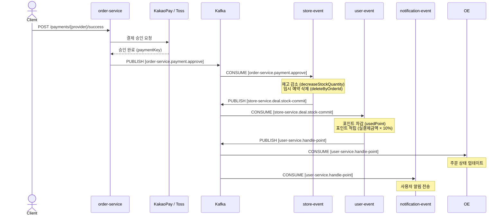
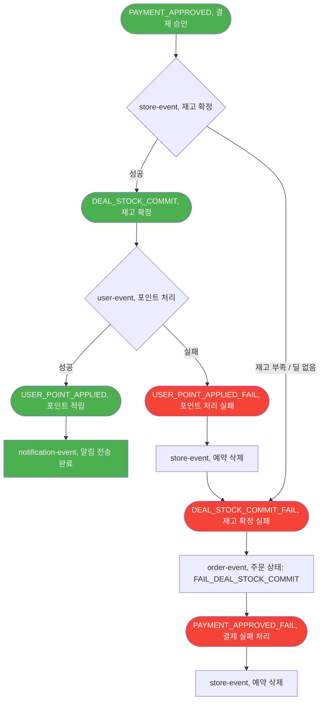
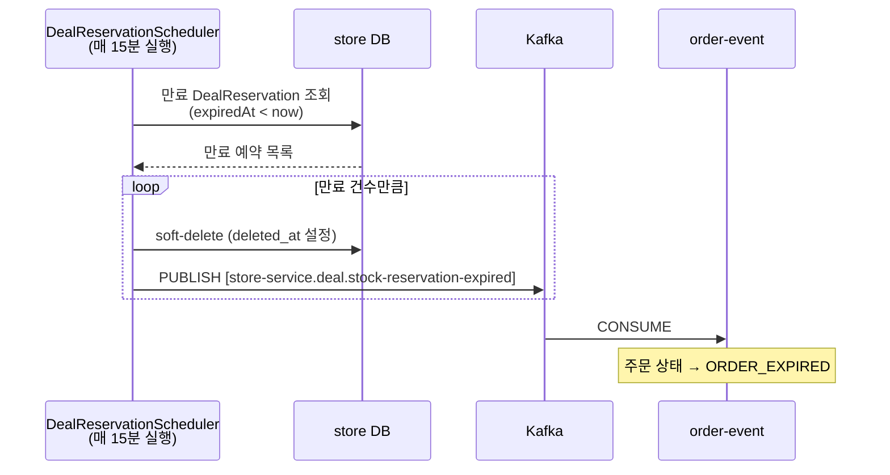

# PickDeal
> 주변 가게의 마감 할인 상품을 픽업하는 서비스입니다.
> 
> 시간이 지날수록 할인율이 높아지는 동적 가격 정책과 Kafka 기반 이벤트 체이닝을 통해 분산 환경에서 안전한 재고 처리 및 주문 흐름을 구현했습니다.

<br/>

## 목차

- [기술 스택](#기술-스택)
- [전체 아키텍처](#전체-아키텍처)
- [프로젝트 구조](#프로젝트-구조)
- [주요 기능](#주요-기능)
- [이벤트 플로우](#이벤트-플로우)
  - [Happy Path](#happy-path)
  - [보상 트랜잭션](#보상-트랜잭션-saga-choreography)
  - [예약 만료 플로우](#예약-만료-플로우)
- [로컬 실행 방법](#로컬-실행-방법)
- [이슈 해결](#이슈-해결)

<br/>

## 기술 스택

|| |
|-------------------|-|
| Language / Build  | Java 17, Gradle (Groovy DSL, Multi-module) |
| Framework         | Spring Boot, Spring Cloud |
| Service Discovery | Spring Cloud Netflix Eureka |
| API Gateway       | Spring Cloud Gateway |
| Message Broker    | Apache Kafka (KRaft 3-node cluster) |
| Database          | PostgreSQL + PostGIS (서비스별 독립 DB) |
| Cache / Session   | Redis (JWT Refresh Token, 블랙리스트) |
| ORM               | Spring Data JPA, Hibernate Spatial |
| Security          | Spring Security (JWT) |
| Geospatial        | PostGIS, JTS, `ST_DWithin` (반경 검색) |
| PG                 | KakaoPay, Toss Payments (Strategy 패턴) |
| Inter-service     | OpenFeign |

<br/>

## 전체 아키텍처


<br/>

## 프로젝트 구조

```
pick-deal/
├── buildSrc/                  # Gradle 컨벤션 플러그인 (공통 의존성 관리)
├── common-module/             # 공통 DTO, Enum, Kafka Event, JWT 유틸
├── api-gateway/               # 단일 진입점, JWT 인증 필터, 라우팅
├── eureka-server/             # 서비스 레지스트리
│
├── user-service/              # 회원가입, 로그인, JWT 발급, 포인트 조회
├── store-service/             # 가게 등록/조회(반경), 딜 관리, 재고 예약
├── order-service/             # 주문 생성, 결제 처리 (KakaoPay / Toss)
│
├── user-event/                # [Kafka Consumer] 포인트 차감/적립
├── store-event/               # [Kafka Consumer] 재고 확정, 예약 만료 스케줄러
├── order-event/               # [Kafka Consumer] 주문 상태 업데이트
├── notification-event/        # [Kafka Consumer] 사용자 알림 (TODO)
│
└── docker/
    └── docker-compose-local.yml
```

<br/>

## 주요 기능

### 주변 딜 탐색
- PostGIS `ST_DWithin` + geography 캐스팅으로 반경(meter) 내 가게 조회
- 딜 목록 조회 시 현재 시각 기준 동적 할인가 계산 (`DiscountCalculator`)

### 동적 할인 가격 정책
- `DiscountPolicy` 엔티티로 딜별 할인 정책 관리
- `PERCENT` / `AMOUNT` 두 가지 할인 타입 지원
- 설정된 인터벌(분) 마다 할인율 증가, 최대 할인 한도 설정 가능

### 재고 임시 예약
- 주문 시점에 `DealReservation` 레코드 생성 (15분 TTL)
- 결제 미완료 시 스케줄러(매 15분)가 만료 예약을 감지하고 재고 반납
- 추후 Redis Sorted Set + Lua Script 방식으로 전환 가능하도록 구현 병행

### PG 결제 전략 패턴 적용
- `PaymentStrategy` 인터페이스 + `KakaoPaymentStrategy` / `TossPaymentStrategy` 구현
- `PaymentProviderHandler`가 `PaymentProvider` enum 기반으로 전략 선택
- 결제 승인 후 이벤트 체인 시작

### 포인트 시스템
- 주문 시 보유 포인트 사용 가능 (차감)
- 결제 완료 후 실결제 금액의 **10% 자동 적립**

### JWT 인증
- Access Token: 5분, Refresh Token: 15일 (Redis 저장)
- 로그아웃 시 Access Token 블랙리스트 등록
- Gateway에서 검증 후 `x-user-id`, `x-user-role` 헤더를 내부 서비스에 주입

<br/>

## 이벤트 플로우

### Kafka Topics

| Topic | 상수명 | 발행 주체 |
|---|---|---|
| `order-service.payment.approve` | `PAYMENT_APPROVED` | order-service |
| `order-service.payment.fail` | `PAYMENT_APPROVED_FAIL` | order-service, order-event |
| `order-service.payment.cancel` | `PAYMENT_CANCELED` | order-service |
| `order-service.order.cancel` | `ORDER_CANCELED` | order-service |
| `store-service.deal.stock-commit` | `DEAL_STOCK_COMMIT` | store-event |
| `store-service.deal.stock-commit-fail` | `DEAL_STOCK_COMMIT_FAIL` | store-event |
| `store-service.deal.stock-reservation-expired` | `DEAL_STOCK_RESERVATION_EXPIRED` | store-event |
| `user-service.handle-point` | `USER_POINT_APPLIED` | user-event |
| `user-service.handle-point-fail` | `USER_POINT_APPLIED_FAIL` | user-event |

---

### Happy Path

결제 승인 이후 비동기로 재고 확정 → 포인트 처리 → 알림까지 자동으로 이어집니다.



---

### 보상 트랜잭션

중앙 오케스트레이터 없이 각 컨슈머가 실패 이벤트를 발행하고 이전 단계를 롤백합니다.



**보상 흐름 요약**

| 실패 시나리오 | 보상 흐름 |
|---|---|
| 결제 승인 실패 (PG 오류) | `PAYMENT_APPROVED_FAIL` → store-event: 예약 삭제 |
| 재고 확정 실패 (품절) | `DEAL_STOCK_COMMIT_FAIL` → order-event: 주문 실패 → `PAYMENT_APPROVED_FAIL` → store-event: 예약 삭제 |
| 포인트 처리 실패 | `USER_POINT_APPLIED_FAIL` → store-event: 예약 삭제 → `DEAL_STOCK_COMMIT_FAIL` → (위와 동일) |
| 사용자 취소 | `PAYMENT_CANCELED` → store-event: 예약 삭제 |

---

### 예약 만료 플로우



## 로컬 실행 방법

### 사전 요구사항
- Docker, Docker Compose
- Java 17
- Gradle 8.x

### 인프라 실행

```bash
cd docker
docker compose -f docker-compose-local.yml up -d
```

> PostgreSQL × 3, Redis, Kafka (KRaft 3-node) 가 실행됩니다.

<br/>

## 이슈 해결

### 1. 이벤트 체이닝 (분산 트랜잭션)

**문제:** 결제 승인 → 재고 확정 → 포인트 처리가 서로 다른 서비스에서 일어나므로, 중간에 실패하면 일관성이 깨짐.

**해결:**
- 중앙 오케스트레이터 없이 각 Kafka 컨슈머가 성공/실패 이벤트를 발행하는 **Choreography 기반 Saga** 패턴 적용
- 각 단계에서 실패 시 이전 단계를 되돌리는 **보상 트랜잭션** 이벤트를 발행하여 최종 일관성 보장

---

### 2. 멱등성 처리

**문제:** 결제 승인 → 재고 확정 → 포인트 처리가 서로 다른 서비스에서 일어나므로, 중간에 실패하면 일관성이 깨짐.

**해결:**
- 중앙 오케스트레이터 없이 각 Kafka 컨슈머가 성공/실패 이벤트를 발행하는 **Choreography 기반 Saga** 패턴 적용
- 각 단계에서 실패 시 이전 단계를 되돌리는 **보상 트랜잭션** 이벤트를 발행하여 최종 일관성 보장

---

### 3. 재고 감소 처리

**문제:** 여러 사용자가 동시에 동일 딜을 주문할 경우 재고가 음수가 되는 Race Condition 발생 가능성.

**해결:**
- 주문 시점에 DB `DealReservation` 테이블에 임시 예약 레코드를 삽입하고, 실제 재고 감소는 결제 완료 이후 Kafka 이벤트를 통해 처리
- `decreaseStockQuantity` 쿼리에서 `stock >= quantity` 조건을 WHERE 절로 걸어 음수 차감 방지 (업데이트 건수 0이면 예외 발생)
- Redis Sorted Set + Lua Script로 원자적 예약 처리 구현도 병행 (DB 방식과 전환 가능하도록 설계)

---

### 4. PG 코드 구조 개선

**문제:** 딜의 현재 할인가를 DB에 직접 저장하면 시간마다 업데이트가 필요하고 조회 시 일관성 문제 발생.

**해결:**
- `DiscountPolicy`에 시작 시각, 인터벌, 할인값, 최대 할인 한도만 저장
- 조회 시점에 `DiscountCalculator`가 `(현재 시각 - startAt) / interval` 로 현재 할인 단계를 계산하여 즉시 반환
- DB 업데이트 없이 언제나 정확한 현재가 제공
